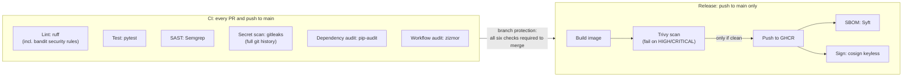

# secure-cicd-demo

[](https://github.com/mrocaruano/secure-cicd-demo/actions/workflows/ci.yml)
[](https://github.com/mrocaruano/secure-cicd-demo/actions/workflows/release.yml)

A deliberately small FastAPI service wrapped in a security-focused CI/CD pipeline on GitHub
Actions. **The app is the cargo; the pipeline is the point.** Every pull request runs a battery of
quality and security gates, and every merge to `main` produces a vulnerability-scanned,
cryptographically signed container image published to the GitHub Container Registry, along with a
software bill of materials (SBOM).

## The application

Two endpoints, about twenty lines of code ([app/main.py](app/main.py)):

- `GET /` returns service metadata
- `GET /health` is a liveness probe, also used by the container's `HEALTHCHECK`

It is small on purpose: the repository exists to demonstrate pipeline design, not application
complexity.

## Pipeline at a glance



### CI workflow: [.github/workflows/ci.yml](.github/workflows/ci.yml)

Six independent jobs run on every pull request and every push to `main`. Each is a gate: a finding
fails the check, and branch protection requires all six before anything merges.

| Job | Tool | What it gates |
| --- | --- | --- |
| `lint` | ruff | Style, bug-prone patterns, and bandit security rules in first-party code |
| `test` | pytest | Application behavior |
| `sast` | Semgrep (`p/default`) | Insecure code patterns (injection, dangerous APIs, and similar) |
| `secrets` | gitleaks | Hardcoded credentials anywhere in the **full git history**, not just the diff |
| `deps` | pip-audit | Known CVEs in the resolved Python dependency tree |
| `workflows` | zizmor | Vulnerabilities in the GitHub Actions workflows themselves |

### Release workflow: [.github/workflows/release.yml](.github/workflows/release.yml)

One job on every push to `main`, with a strict internal ordering:

1. **Build** the image locally on the runner. Nothing is published at this point.
2. **Scan** it with Trivy. Any fixable HIGH or CRITICAL vulnerability fails the run, so a
   vulnerable image can never reach the registry. The `ignore-unfixed: true` setting keeps the
   gate actionable: it only fails on vulnerabilities that a rebuild or version bump could
   actually fix.
3. **Push** to `ghcr.io/mrocaruano/secure-cicd-demo` (tags: `latest` plus the full commit SHA).
4. **Generate an SBOM** with Syft in SPDX JSON format, attached to the run as an artifact.
5. **Sign** the pushed digest with cosign keyless signing, bound to this repository's workflow
   identity through GitHub's OIDC provider. There is no signing key to store, leak, or rotate.

The only credential in the entire pipeline is the ephemeral, per-job `GITHUB_TOKEN`. No long-lived
secrets are configured anywhere in the repository.

## Security design

Each control maps to one stage of a supply-chain attack, one gate per stage:

| Attack stage | Control | Where |
| --- | --- | --- |
| Secret committed to the repo | gitleaks full-history scan; GitHub secret scanning and push protection | CI plus repo settings |
| Vulnerable first-party code | Semgrep SAST; ruff bandit rules | CI |
| Known-vulnerable dependency | pip-audit at PR time; Dependabot patches pip, Actions, and Docker deps weekly | CI plus [dependabot.yml](.github/dependabot.yml) |
| Malicious or vulnerable base image | Base image pinned by digest; Trivy gate on the built image | [Dockerfile](Dockerfile) plus Release |
| Compromised pipeline | zizmor audit; SHA-pinned actions; deny-by-default token permissions | Workflows |
| Tampered artifact after build | cosign keyless signature plus SBOM | Release |

The reasoning behind the less obvious choices:

- **Actions pinned to commit SHAs, not tags.** Tags are mutable. The `tj-actions/changed-files`
  compromise in March 2025 worked exactly this way: existing release tags were repointed at
  malicious code, which then exfiltrated CI secrets from thousands of repositories. A full SHA pin
  cannot be repointed. The trailing version comment keeps it readable for humans, and Dependabot
  keeps the pins fresh.
- **`permissions: {}` at the workflow level.** The default `GITHUB_TOKEN` can write repository
  contents. Starting from zero and opting in per job means a compromised step in, say, the lint
  job holds a token that can only read code. It cannot push commits, packages, or releases.
- **gitleaks scans the whole history.** Deleting a leaked secret in a follow-up commit does not
  unleak it; anyone who clones the repo still has it. Catching it at PR time, before merge, is the
  only cheap moment. After that the only real fix is rotating the credential.
- **zizmor audits the pipeline itself.** Workflows are code that runs with credentials. Script
  injection through `${{ }}` template expansion and over-privileged tokens are the classic failure
  modes, so the pipeline gates its own configuration the same way it gates the app.
- **Trivy runs between build and push.** Code-level scanners never see the CVEs that ship inside
  the base image. Scanning the assembled artifact does, and failing the run (instead of just
  filing a report) is what turns the scan from a dashboard into a control.
- **cosign keyless signing plus SBOM.** The signature proves the image was built by this repo's
  release workflow on `main`, not by a developer laptop or an attacker with a stolen registry
  password. The SBOM means that when the next log4shell-class CVE drops, "are we affected?" is a
  one-line query instead of an archaeology project.

### Repository settings (defense outside the workflows)

- **Branch protection on `main`**: all six CI checks are required before merge.
- **Secret scanning with push protection**: GitHub blocks pushes containing recognizable provider
  credentials before they ever land.
- **Dependabot alerts and security updates**: vulnerable dependencies get an automatic PR, not
  just a warning.

### Proof the gates actually block

[Pull request #1](https://github.com/mrocaruano/secure-cicd-demo/pull/1) is left open on purpose.
It introduces a fake hardcoded credential, a failing test, and a known-vulnerable pinned
dependency. The corresponding three checks fail while the unrelated gates stay green, and branch
protection disables the merge button.

## The deployed artifact

```bash
docker pull ghcr.io/mrocaruano/secure-cicd-demo:latest
docker run --rm -p 8000:8000 ghcr.io/mrocaruano/secure-cicd-demo:latest
curl http://localhost:8000/health
```

Verify the image really came from this repository's release workflow (requires
[cosign](https://docs.sigstore.dev/cosign/system_config/installation/)):

```bash
cosign verify ghcr.io/mrocaruano/secure-cicd-demo:latest \
  --certificate-identity 'https://github.com/mrocaruano/secure-cicd-demo/.github/workflows/release.yml@refs/heads/main' \
  --certificate-oidc-issuer https://token.actions.githubusercontent.com
```

The SBOM for each release is attached as the `sbom.spdx.json` artifact on the corresponding
[Release run](https://github.com/mrocaruano/secure-cicd-demo/actions/workflows/release.yml).

## Running locally

```bash
python -m venv .venv && source .venv/bin/activate   # .venv\Scripts\activate on Windows
pip install -r requirements-dev.txt

pytest                                              # tests
ruff check . && ruff format --check .               # lint
uvicorn app.main:app --reload                       # serve on http://localhost:8000
```

Or with Docker:

```bash
docker build -t secure-cicd-demo .
docker run --rm -p 8000:8000 secure-cicd-demo
```

## Reproducing the pipeline in a fork

Fork the repo, enable Actions, and push. That's it. The pipeline intentionally requires **zero
configured secrets**: GHCR pushes and cosign signing both authenticate with the workflow's own
short-lived `GITHUB_TOKEN` and OIDC credentials. Branch protection and push protection are repo
settings, so re-enable those under *Settings* in the fork.

## What I would harden next

Left out deliberately to keep the exercise scoped. Roughly in priority order for a production
path:

1. **Deployment environments with required reviewers**, so publishing means promotion from
   staging to production with a human approval, not just "merge equals release".
2. **CodeQL** alongside Semgrep for deeper dataflow analysis and Security tab integration.
3. **SLSA build provenance attestations** (`actions/attest-build-provenance`) on top of the
   cosign signature.
4. **Runner egress filtering** (for example `step-security/harden-runner`) to catch exfiltration
   from a compromised build step.
5. **DAST** (for example OWASP ZAP) against an ephemeral deployment of the built image.
6. **CODEOWNERS plus required reviews** once there is more than one human.
